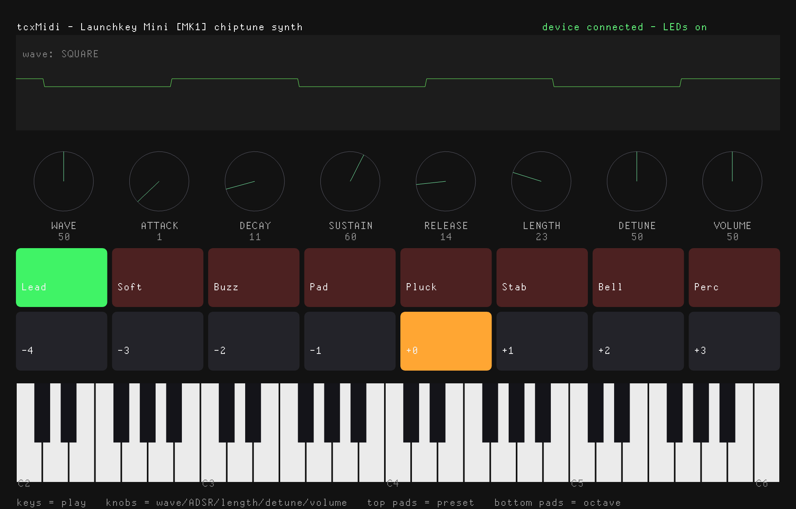

# trussc-launchkeyMini-demo

A small [TrussC](https://github.com/TrussC-org/TrussC) demo for the Novation
**Launchkey Mini [MK1]**. It is a real example of the MIDI add-on
**[tcxMidi](https://github.com/TrussC-org/TrussC/tree/main/addons/tcxMidi)**.

Play the keys: they drive TrussC's ChipSound as a polyphonic chiptune synth.
The 8 knobs shape the sound live, the pads pick presets and octaves, and the
screen mirrors everything the hardware sends.



## What you need

- A **Novation Launchkey Mini Mk1** (the original)
- TrussC (with the `trusscli` tool)
- The `tcxMidi` add-on (it ships with TrussC and is listed in `addons.make`,
  so it is found automatically)

## Build & run

```bash
git clone git@github.com:tettou771/trussc-launchkeyMini-demo.git
cd trussc-launchkeyMini-demo
trusscli update
trusscli run
```

Plug in the Launchkey first. The app finds it and connects on its own. With no
device it still starts, but the keys/knobs/pads come from MIDI, so nothing
plays until you connect one.

## Controls

| Control | What it does |
|---------|--------------|
| **Keys** | Play notes (velocity sensitive, polyphonic). |
| **Knobs** | Shape the live patch: WAVE / ATTACK / DECAY / SUSTAIN / RELEASE / LENGTH / DETUNE / VOLUME. Every new note is built from the current knob values. |
| **Top pads** | Pick one of 8 preset patches (Lead, Soft, Buzz, Pad, Pluck, Stab, Bell, Perc). The selected pad lights **green**. |
| **Bottom pads** | Transpose the keyboard by octave (−4 … +3). The selected pad lights **amber**. |

ChipSound renders a fixed-length buffer per note, so holding a key doesn't
sustain past the note length — that's the chiptune grain. Turn the LENGTH and
ADSR knobs to reshape each new note.

## Pad LEDs (best effort)

The pads have **red/green 2-colour LEDs** (no blue). To light them the demo
sends the InControl / "extended mode" enable, then drives each pad with a
Note On whose velocity is `16*green + red` (each 0–3).

This is documented for the **Mk2**; on a real **Mk1** it is unconfirmed. If your
device ignores it the keyboard and knobs still work — the pads just stay dark.
None of this uses SysEx, so unlike the Launchpad demo it can also run on the
Web (Web MIDI input; LED output is browser-dependent).

## Other devices

This demo is tuned for the **Launchkey Mini Mk1**:

- **Keys** are standard Note On/Off on channel 1, so any MIDI keyboard plays.
- **Knobs** expect **CC 21–28**. Other controllers send different CCs.
- **Pads** expect extended-mode notes **96–103 / 112–119 on channel 16**, and
  the 2-colour LED encoding above. Other devices differ.

> Making something for another controller? First run tcxMidi's **`example-basic`**
> to see which notes / CCs your device sends, then build from there.
> `example-basic` works with any MIDI device.

## How it works (notes)

The device-specific code (port choice, extended mode, note/CC layout, LED
encoding) lives in `LaunchkeyMini.h`. The synth is split into small, readable
pieces:

- `Patch.h` — the live patch, the 8-knob mapping, and the 8 presets.
- `Voices.h` — a 16-voice pool of one-shot ChipSound notes.
- `tcApp` — wires the device to the synth and draws the scope / knobs / pads /
  keyboard.

The Mini exposes two USB-MIDI ports: keys and knobs arrive on the main port,
while the extended-mode pad messages and LED control use the second
"InControl" port. The wrapper opens whatever it can find and merges the input.

## License

MIT
